# SamaajSetu — Mermaid Diagrams Pack

Companion to `solution_report.md` and `product_architecture.md`. All diagrams render in any Mermaid-compatible viewer (GitHub, VS Code, Obsidian, Mermaid Live).

**Contents**
1. [System Context (C4-Lite)](#1-system-context-c4-lite)
2. [Use Case Diagram (All Personas)](#2-use-case-diagram-all-personas)
3. [End-to-End Process Flow](#3-end-to-end-process-flow)
4. [Microservices & GCP Component Architecture](#4-microservices--gcp-component-architecture)
5. [Data Pipeline (Ingestion → Analytics)](#5-data-pipeline-ingestion--analytics)
6. [Need Lifecycle State Machine](#6-need-lifecycle-state-machine)
7. [Assignment Lifecycle State Machine](#7-assignment-lifecycle-state-machine)
8. [Sequence — Paper Survey to Published Need](#8-sequence--paper-survey-to-published-need)
9. [Sequence — Volunteer Matching & Dispatch](#9-sequence--volunteer-matching--dispatch)
10. [Sequence — Disaster Crisis Mode](#10-sequence--disaster-crisis-mode)
11. [Sequence — Beneficiary SMS/IVR Intake](#11-sequence--beneficiary-smsivr-intake)
12. [Sequence — Volunteer Voice / Feedback Channel](#12-sequence--volunteer-voice--feedback-channel)
13. [Entity Relationship Diagram](#13-entity-relationship-diagram)
14. [Volunteer User Journey](#14-volunteer-user-journey)
15. [Deployment Topology (GCP)](#15-deployment-topology-gcp)
16. [Privacy & PII Flow](#16-privacy--pii-flow)
17. [Module Mindmap](#17-module-mindmap)

---

## 1. System Context (C4-Lite)

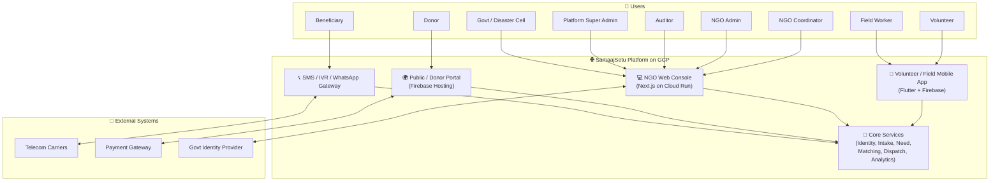

---

## 2. Use Case Diagram (All Personas)

```mermaid
flowchart LR
    classDef actor fill:#e3f2fd,stroke:#1976d2,stroke-width:2px,color:#000
    classDef uc fill:#fff8e1,stroke:#f57f17,color:#000
    classDef sys fill:#f3e5f5,stroke:#6a1b9a,color:#000

    V(("👤 Volunteer")):::actor
    FW(("👤 Field Worker")):::actor
    B(("👤 Beneficiary")):::actor
    C(("👤 Coordinator")):::actor
    A(("👤 NGO Admin")):::actor
    AU(("👤 Auditor")):::actor
    D(("👤 Donor")):::actor
    G(("👤 Govt Cell")):::actor
    SA(("👤 Super Admin")):::actor

    subgraph SYS["🌐 SamaajSetu System"]
        UC1["Sign up / Login (OTP)"]:::uc
        UC2["Build profile, skills, availability"]:::uc
        UC3["Receive personalized need feed"]:::uc
        UC4["Accept task / Check-in"]:::uc
        UC5["Submit completion proof"]:::uc
        UC6["Raise concern (Voice channel)"]:::uc
        UC7["View impact & badges"]:::uc

        UC10["Capture paper survey / photo"]:::uc
        UC11["Log offline need"]:::uc
        UC12["Capture beneficiary consent"]:::uc

        UC20["Request help via SMS / IVR"]:::uc
        UC21["Track request status"]:::uc

        UC30["Triage incoming needs"]:::uc
        UC31["Run smart matcher"]:::uc
        UC32["Dispatch volunteers"]:::uc
        UC33["Monitor mission control"]:::uc
        UC34["Review feedback / sentiment"]:::uc
        UC35["Generate impact reports"]:::uc

        UC40["Configure org & policies"]:::uc
        UC41["Manage staff / RBAC"]:::uc
        UC42["Define retention / consent"]:::uc
        UC43["Manage billing & integrations"]:::uc

        UC50["Audit access logs"]:::uc
        UC51["Export DPIA evidence pack"]:::uc

        UC60["View transparency portal"]:::uc
        UC61["Donate / sponsor program"]:::uc
        UC62["Receive impact report"]:::uc

        UC70["Declare disaster / crisis"]:::uc
        UC71["Cross-NGO situational view"]:::uc
        UC72["Broadcast verified alert"]:::uc

        UC80["Manage tenants & abuse"]:::uc
        UC81["Monitor model drift / SLOs"]:::uc
    end
    SYS:::sys

    V --> UC1 & UC2 & UC3 & UC4 & UC5 & UC6 & UC7
    FW --> UC1 & UC10 & UC11 & UC12
    B --> UC20 & UC21
    C --> UC30 & UC31 & UC32 & UC33 & UC34 & UC35
    A --> UC40 & UC41 & UC42 & UC43 & UC35
    AU --> UC50 & UC51
    D --> UC60 & UC61 & UC62
    G --> UC70 & UC71 & UC72 & UC33
    SA --> UC80 & UC81
```

---

## 3. End-to-End Process Flow

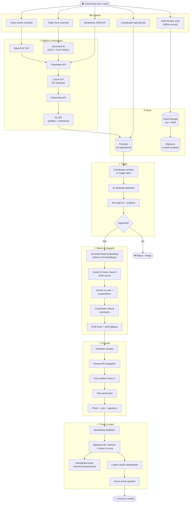

---

## 4. Microservices & GCP Component Architecture

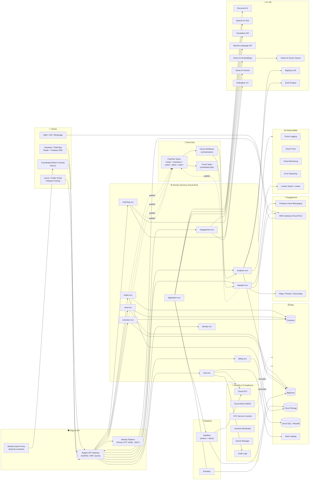

---

## 5. Data Pipeline (Ingestion → Analytics)

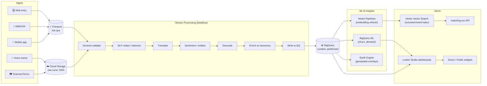

---

## 6. Need Lifecycle State Machine

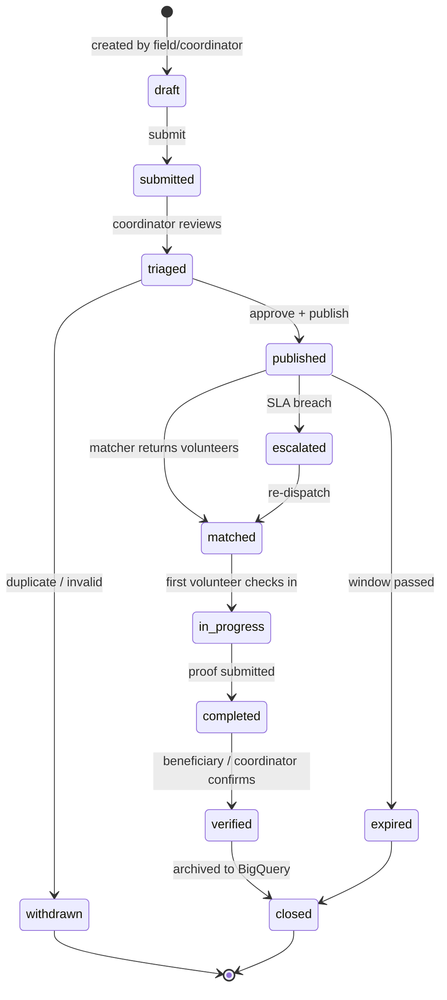

---

## 7. Assignment Lifecycle State Machine

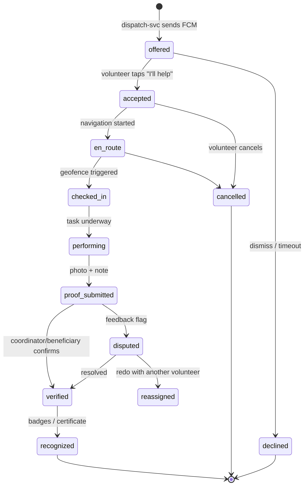

---

## 8. Sequence — Paper Survey to Published Need

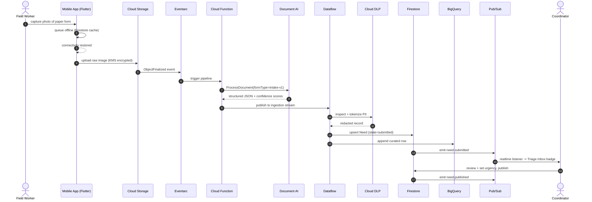

---

## 9. Sequence — Volunteer Matching & Dispatch

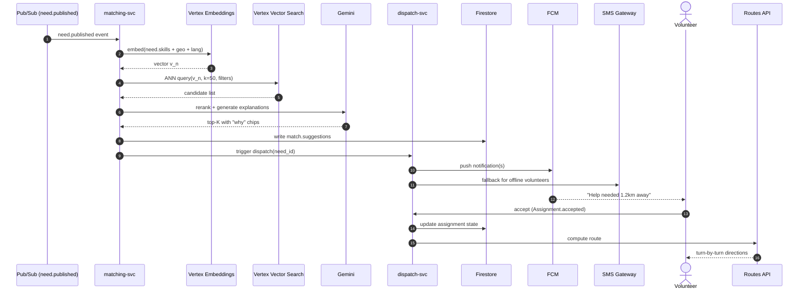

---

## 10. Sequence — Disaster Crisis Mode

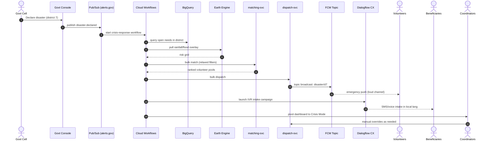

---

## 11. Sequence — Beneficiary SMS/IVR Intake

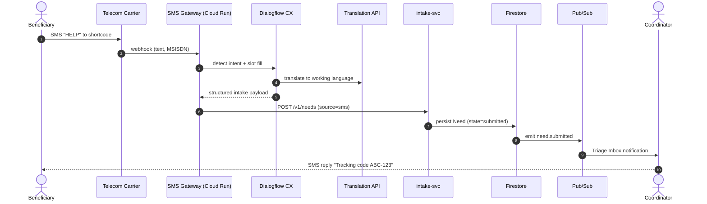

---

## 12. Sequence — Volunteer Voice / Feedback Channel

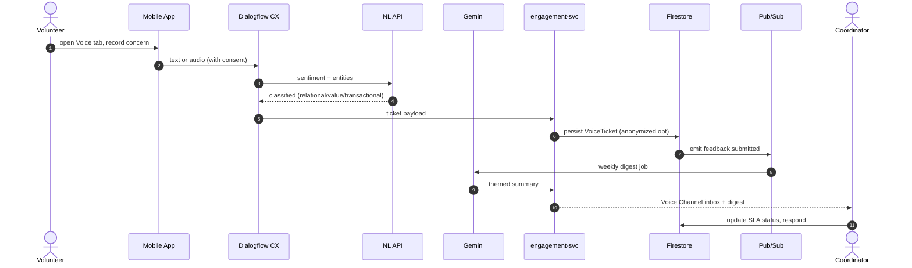

---

## 13. Entity Relationship Diagram

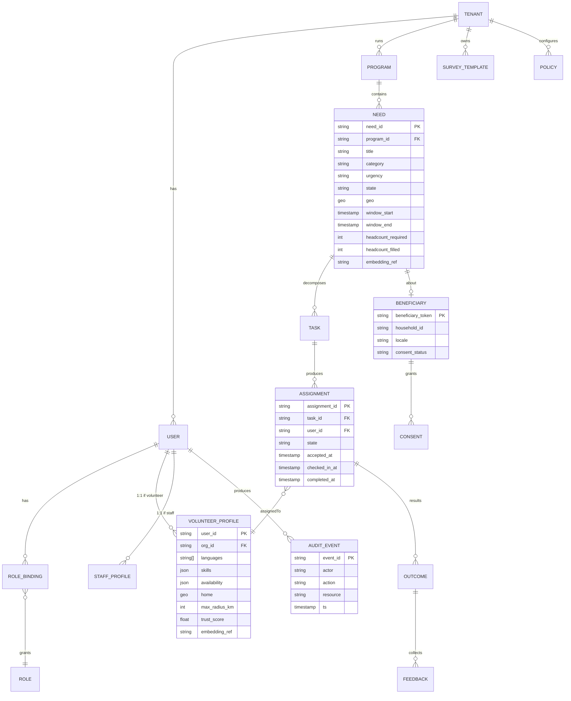

---

## 14. Volunteer User Journey

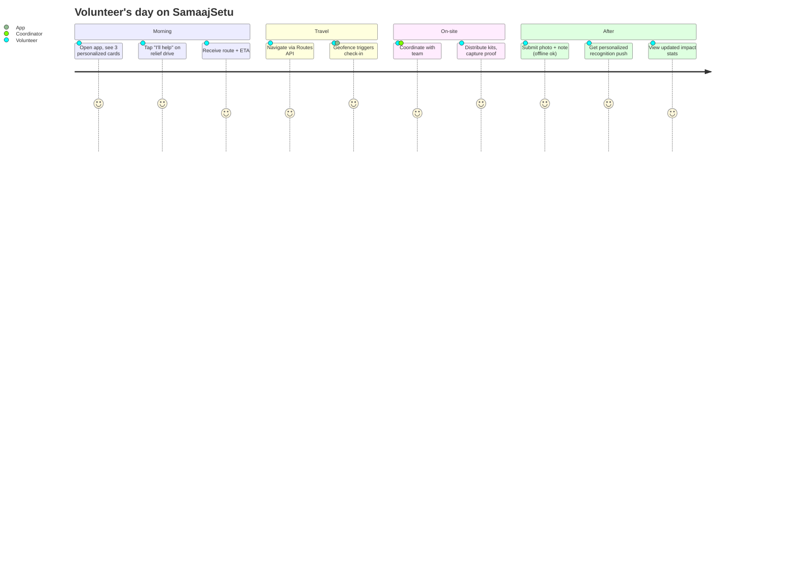

---

## 15. Deployment Topology (GCP)

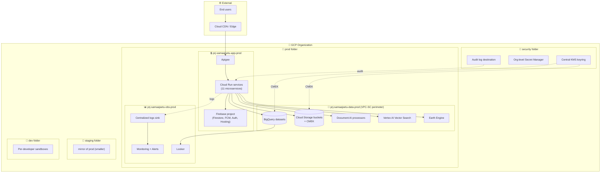

---

## 16. Privacy & PII Flow

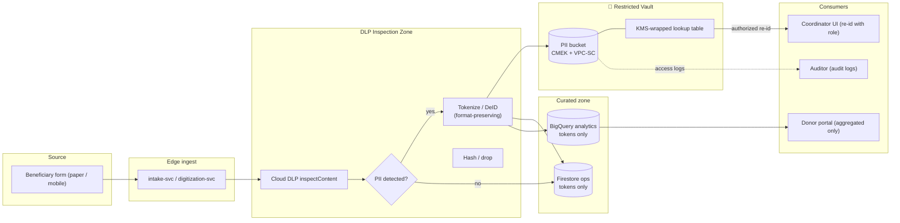

---

## 17. Module Mindmap

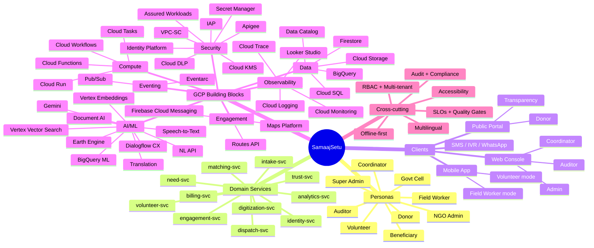

---

*Document version: 1.0 — generated 2026-04-28*
*Render in: GitHub, VS Code (Markdown Preview Mermaid Support), Obsidian, mermaid.live, Notion.*
